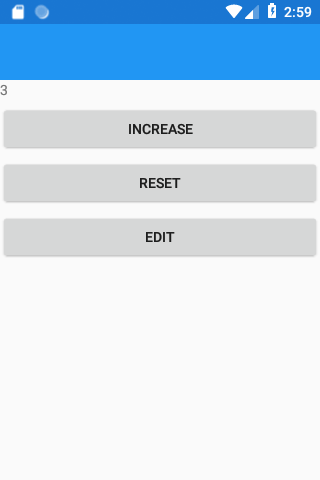

# Popis vzorového úkolu

Příklad obsahuje základy toho, co byste měli znát abyste uspěli u testu.

Test bude mít dvě části, písemný test a potom ústní rozpravu.

## Hodnocení testu:

#### Minimální znalosti na hodnocení E - dostatečně

- Znalost základních pojmů View, ViewModel, Bindování, PropertyChanged, Command
- Znalost použití Bindování v jazyku XAML a C#
- Znalost použití eventu `PropertyChanged` a rozhraní `INotifyPropertyChanged`
- Vytváření instance ViewModelu v jazyce XAML nebo C#

#### Minimální znalosti na hodnocení B - velmi dobře
- Znalost XAML jmenných prostorů, mapování XAML jmenných prostorů (`xmlns:x`) a definice kódu na pozadí  (`x:Class`)
- Znalost použití třídy `Command`
- Znalost použití hierarchické navigace
#### Minimální znalosti na hodnocení A - výborně a lepší
- Znalost použití klíčových slov `async` a `await`


## Základní pojmy:

- **View** - typicky jedno okno aplikace, tedy to co vidí uživatel
- **ViewModel** - je třída obsahující data pro zobrazení, konkrétně property, které chceme zobrazovat ve View. Například *MainViewModel*. Mmodel jsou obecně data v paměti.
- **Bindování** - mechanismus pomocí kterého spolu komunikují View a View model a přitom na sebe nemají přímou referenci, což umožňuje nezávislý vývoj a testování.
- **PropertyChanged** - event v rozhraní *INotifyPropertyChanged* pomocí kterého ViewModel informuje control ve View, například TextBox, že došlo ke změně property ve ViewModelu a View ji má znovu načíst a zobrazit.
- **Command** - pomocí commandů může View volat metody ViewModelu a opět na sebe nemusí mít referenci. Commnand je potom třída implementující rozhraní *ICommand*. Ve ViewModelu potom vytváříme property typu Commmand a předáváme jí delegáta na metodu ve ViewModelu, kterou chceme zavolat. Ve View potom například Button na tuto property Command binduje.

## Popis příkladu


Kód popisovaný v následujícím textu najdete v projektu [Exam](Exam/Exam), který obsahuje kód společný pro všechny platformy.

Nejdůležitější soubory v projektu jsou:

- [MainPage.xaml](Exam/Exam/MainPage.xaml) - View obsahující hlavní stránku aplikace obsahující `Label` a `Button` pro zvýšení hodnoty počítadla, reset hodnoty počítadla a pro editaci hodnoty počítadla, kdy naviguje na druhé View  [EditPage.xaml](Exam/Exam/EditPage.xaml)

    

- [EditPage.xaml](Exam/Exam/EditPage.xaml) - View obsahující `Entry` pro editaci hodnoty počítadla.

    

- [CounterViewModel.cs](Exam/Exam/CounterViewModel.cs) - ViewModel, který má property `Number`, `CommandIncrease`, `CommandReset` a `CommandNavigateToEdit`. Obě View v tomto příkladu sdílejí jednu instanci tohoto ViewModelu.

Dále si popíšeme základní principy použíté v tomto příkladu:

- Bindování

1. Nejprve vytvoříme v souboru [App.xaml.cs](Exam/Exam/App.xaml.cs) instanci našeho ViewModelu a předáme ji v konstruktoru třídě `MainPage`. Kvuli hierarchické navigaci navíc ještě použijeme třídu `NavigationPage`:

    ```cs 
    MainPage mainPage = new MainPage(new CounterViewModel());
    MainPage = new NavigationPage(mainPage);
    ```

    Třída MainPage potom v konstruktoru nastaví svůj `BindingContext` na referenci typu `CounterViewModel`:

    ```cs 
    CounterViewModel _viewModelPocitadlo;
        
    public MainPage(CounterViewModel viewModelPocitadlo)
    {
        InitializeComponent();

        _viewModelPocitadlo = viewModelPocitadlo;
        BindingContext = _viewModelPocitadlo;
    }
    ```

    Poznámka: Instanci ViewModelu můžeme vytvářet různými způsoby, například přímo v jazyku XAML.

2. Pomocí markup extension `Binding` nabindujeme property `Text` elementu `Label` na hodnotu property `Number` objektu přiřazeného propertě `BidingContext` třídy `MainPage`, což je instance třídy `CounterViewModel` přiřazená v předchozím kroku.

    ```XAML
    <Label Text="{Binding Number}" />
    ```

    Třída `CounterViewModel` potom obsahuje kromě jiného property `Number`. Použití eventu `PropertyChange` vysvětlíme později:

    ```cs 
    public class CounterViewModel : INotifyPropertyChanged
    {
        // dalsi kod

        public int Number
        {
            get { return _number; }
            set { _number = value; OnPropertyChanged();}
        }

        // dalsi kod
    }
    ```
- Command

    Nejprve ve ViewModelu vytvoříme property typu `Command` a poté vytvoříme její instanci. V konstruktoru jí potom předáme referenci na metodu, která se má zavolat když uživatel stiskne například tlačítko.

    Například v našem ViewModelu `CounterViewModel` máme property `CommandIncrease` typu `Command`:

    ```cs
    public Command CommandIncrease { get; set; }
    ```

    V konstruktoru potom vytváříme instanci třídy `Command` a v konstruktoru jí předáváme referenci na metodu `Increase`:

    ```cs
    CommandIncrease = new Command(Increase);
    ```

    V metodě `Increase` potom zvyšujeme hodnotu počítadla reprezentovanou property `Number`:

    ```cs
    private void Increase()
    {
        ++Number;
    }
    ```

    Ve třídě `MainPage` potom bindujeme property Command třídy Button na property `CommandIncrease` třídy `CounterViewModel`:
    ```XAML
    <Button Text="Increase" Command="{Binding CommandIncrease}" />
    ```

    Ve View EditPage potom bindujeme na property `Number` pomocí zápisu  `Mode=TwoWay` obousměrmě, tedy property můžemě i měnit:

    ```XAML
    <Entry Text="{Binding Number, Mode=TwoWay}"
                Placeholder="number"
                SelectionLength="10"
                Keyboard="Numeric"
                VerticalOptions="CenterAndExpand" 
                HorizontalOptions="CenterAndExpand" />
    ```
- PropertyChanged
  
    View aktivně nezjištujě zda se změnily hodnoty property ve ViewModelu a mají se zaktualizovat zobrazení. Aby nabidnované elementy ve View reagovali na změny musíme použít event `PropertyChanged` z rozhraní `InNotifyPropertyChanged`.

    V našem příkladu implementuje rozhraní `InNotifyPropertyChanged` přímo třída `CounterViewModel`. Díky použití atributu `[CallerMemberName]` nemusíme jako parametr předávat název property. Díky použití operátoru `?.` se metoda `Invoke` nezavolá pokud by měl event `PropertyChanged` hodnotu `null`.

    ```cs
    public class CounterViewModel : INotifyPropertyChanged
    {
        public event PropertyChangedEventHandler PropertyChanged;

        protected void OnPropertyChanged([CallerMemberName]string name = null)
        {
            PropertyChanged?.Invoke(this, new PropertyChangedEventArgs(name));
        }

        // dalsi kod
    }
    ```

    Metodu `OnPropertyChanged` potom nejčastěji voláme se setteru property, například zde voláme tuto metodu v setteru property `Number`:

    ```cs
    public int Number
    {
        get { return _number; }
        set { _number = value; OnPropertyChanged();}
    }
    ```


- Navigace

    V příkladu využíváme hierarchickou navigaci, proto jsme při vytváření instance třídy `MainPage` použili i třídu `NavigationPage`.

    V příkladu potom máme v třídě `CounterViewModel` property `CommandNavigateToEdit`:

    ```cs
    public Command CommandNavigateToEdit { get; set; }
    ```

    Pomocí tohoto Commandu potom voláme metodu `NavigateToEdit`. V této metodě pomocí metody `PushAsync` navigujeme na View `EditPage` a v konstrukotru předáváme pomocí klíčového slova `this` referenci na `CounterViewModel` ve kterém se nacházíme. Obě View tedy budou sdílet stejný ViewModel.

    ```cs
    async private void NavigateToEdit()
    {
        EditPage editPage = new EditPage(this);
        INavigation navigation = Application.Current.MainPage.Navigation;

        await navigation.PushAsync(editPage);
    }
    ```

    Poznámky: 
    - použití async a await není v tomto příkladě nutné. Mělo by význam jen, pokud bychom chtěli provést nejakou akci až potom co se navigace dokončí.
    - Jednotlivá view nemusí vždy sdílet stejný ViewModel, záleží na typu aplikace. Často se v této souvisloti používá IoC konteiner, což jsem ale v tomto předmětu neprobírali.
